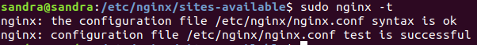
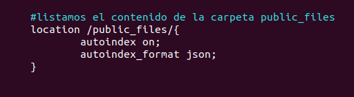

<h1 style="text-align:center"> PRÁCTICA NGINX</h1>


**Nginx** es un servidor web de código abierto, creado en 2004 y actualmente uno de los más utilizados a nivel mundial. También es utilizado como proxy inverso, balanceador de carga HTTP y proxy de correo electrónico para IMAP, POP3 y SMTP. Fue concebido como un intento de hacer frente al problema C10K (reto de gestionar 10000 conexiones al mismo tiempo).

**Características:**

- Es asíncrono, los subprocesos se ejecutan simultáneamente sin bloquearse entre sí.
- Controlado por eventos que marcan el inicio o finalización de un proceso.
- Su arquitectura optimiza la memoria y la CPU, haciéndolo más rápido.
- Puede procesar miles de solicitudes sin dificultad.
- No crea un nuevo proceso para cada nueva solicitud, el proceso acepta las solicitudes y las procesa a través de bucles.
- El rendimiento y la escalabilidad no dependen completamente de los recursos del hardware.

***

## OBJETIVOS DE LA PRÁCTICA

En esta práctica aprenderemos a utilizar y configurar el servidor Nginx y a crear Hosts Virtuales para alojar nuestros proyectos. Los **hosts virtuales** son alojamientos virtuales de nuestros sitios webs que sirven para poder ejecutar más de un sitio web en un mismo servidor, permitiéndonos así, compartir recursos.


**Instalación de Nginx**

```
sudo apt-get install nginx
```

Verificamos que esté instalado

```
nginx -v
```


A continuación debemos configurar el firewall para que permita el acceso a Nginx:

Para ello, debemos elegir que perfil de Nginx queremos permitir. Para listar los perfiles 
de Nginx, utilizamos el siguiente comando:

  ```
  sudo ufw app list
  ```


Los perfiles que ofrece Nginx son:

- **Nginx Full**: Abre el puerto 80 (tráfico normal, no cifrado) y el 443 (tráfico TLS/SSL cifrado).
- **Nginx HTTP**: Solo abre el puerto 80.
- **Nginx HTTPS**: Solo abre el puerto 443.

Elegimos habilitar el perfil _Full_, para ello tecleamos el siguente comando:

  ```
  sudo ufw allow 'Nginx Full'
  ```

**Comandos del servidor**

- Iniciar, parar, ver estado, reiniciar o recargar el servidor:

  ```
  sudo service nginx start/stop/status/restart/reload
  ```

- Verificar sintaxis

  ```
  sudo nginx -t
  ```

***

# SITIO 1

Este primer sitio permitirá visualizar una página php.

**Requisitos:**

1. Estar publicada en el puerto 82.
2. El directorio donde se encuentra el contenido del sitio será /var/www/sitioPhp.
3. Los logs se situarán en el directorio /etc/logs/sitioPhp
4. Debe tener activada la compresión de ficheros que superen los 80kb.
5. Dispondrá de una página que se mostrará al acceder a una ruta que no exista (404.html), que estará situada en /var/www/errores.
6. Al acceder al path http://localhost:82/public_files, el sitio web mostrará el listado de ficheros en formato json.
7. No permitirá el acceso al contenido de nuestro servidor cuando en el path del contenido a obtener, se encuentre la palabra private.


## 1 y 2. GUARDAR EL CONTENIDO DEL SITIO EN LA RUTA /var/www/sitioPhp Y PUBLICAR LA PÁGINA EN EL PUERTO 82.

- Iniciamos el servidor Nginx

  ```
  sudo service nginx start
  ```

- Verificamos que esté iniciado

  ```
  sudo service nginx status
  ```

  


- Creamos el host virtual en la carpeta _/var/www_.

  ```
  sudo mkdir -p /var/www/sitioPhp
  ```

  


- Otorgamos permisos de acceso y modificación.

  ```
  sudo chmod -R 755 /var/www/sitioPhp
  ```

- En su interior, creamos la página php que queremos mostrar

  ```
  sudo touch index.php
  ```

   


- Insertamos contenido en el archivo

  ```
  vim index.php
  ```

  

- Creamos el fichero de configuración de nuestro host virtual dentro del directorio /etc/nginx/sites-availabe, copiando el que nos proporciona Nginx por defecto (default) y que está situado en esa misma carpeta. Lo renombramos a sitioPhp.

  

- Lo editamos:

  - Cambiamos el puerto por donde publicaremos la página:

     

  - Le damos un nombre a nuestro servidor:

     

  - Modificamos el directorio donde se encuentra nuestra página:

     

  - Añadimos index.php tal como nos indica en el archivo de configuración, para que se reconozca nuestra aplicación:

     

  - Descomentamos la configuración de php para FastCGI server como vemos en la imagen siguiente, cambiando la versión de php por la que hay instalada en el equipo (7.2). El php-fpm se encargará de procesar la petición que se realiza en el navegador para visualizar nuestra página.

     

  - Habilitamos el sitio, creando un enlace simbólico dentro de la carpeta _sites-enabled_ que hará referencia al fichero de configuración de nuestro host, creado en el directorio _sites-available_:

    ```
    sudo ln -s /etc/nginx/sites-available/sitioPhp /etc/nginx/sites-enabled
    ```

    

  - Verificamos que tengamos php instalado en el equipo para poder visualizar la página:

    ```
    php -v
    ```

    

  - En caso de no tenerlo instalado, tecleamos el siguiente comando:

    ```
    sudo apt install php-7.2
    ```

  - Verificamos sintaxis.
 
    ```
    sudo nginx -t
    ```

    

  - Recargamos la configuración de Nginx:

    ```
    sudo service nginx reload
    ```

  - Abrimos el navegador y visualizamos la página en la ruta _localhost:82_:

    


## 3. SITUAR LOS LOGS EN EL DIRECTORIO /etc/logs/sitioPhp

- Creamos la estructura de carpetas especificada en la ruta:

  


- Añadimos la directiva _access_log_ con su ruta, en el archivo de configuración de nuestro host (sitioPhp) situado en la ruta _/etc/nginx/sites-available_. Especificando asímismo el nombre que queremos darle al archivo de logs (se creará automáticamente).


  

- Verificamos sintaxis.

- Reiniciamos servidor-

- Verificamos que el archivo se ha creado correctamente en la ruta y verificamos que guarde los logs:

  

## 4. ACTIVAR LA COMPRESIÓN DE FICHEROS QUE SUPEREN LOS 80KB.

Para ello utilizaremos **Gzip**. Gzip es un módulo de Nginx que se encarga de la compresión y descompresión de ficheros.

- Primero, creamos una carpeta nueva llamada _plantilla_ en el directorio de nuestra aplicación (_/var/etc/wwww/sitioPhp_) y dentro nos descargamos la plantilla css del siguiente enlace: https://startbootstrap.com/themes/freelancer/

  

- Entramos en el navegador y accedemos a la plantilla desde nuestra página en localhost:82/plantilla/ y en el apartado Network (parte inferior derecha) observamos que su tamaño inicial es de 784 KB transferidos.

  

- Para proceder con la compresión, primero habilitamos Gzip en nuestro servidor:

   - Vamos al fichero de configuración principal, _nginx.conf_ situado en la ruta _/etc/nginx/_.

   - En el apartado Gzip Settings, establecemos la directiva Gzip a on, descomentando todas las opciones y añadiendo _gzip_min_length 80;_ para que se aplique la compresión a los archivos mayores de 80 KB, como es nuestro caso.

     

  - Verificamos sintaxis.

  - Reinciamos servidor.

  - Volvemos a entrar al navegador y comprobamos que los datos se han comprimido y el tamaño de KB transferidos a pasado de 784 a 454.

     

  
  ## 5. CREAR UNA PÁGINA QUE SE MOSTRARÁ AL ACCEDER A UNA RUTA QUE NO EXISTA (404.html), SITUADA EN _/var/www/errores_.


- Primero, creamos el directorio errores en la ruta _/var/wwww/_ y a continuación creamos el archivo 404.html dentro de este directorio:

  

- Insertamos el mensaje de error en el archivo:

  

- Damos permisos de acceso a la carpeta errores.

- Modificamos el archivo de configuración de nuestro host (sitioPhp) dentro de la ruta _/etc/nginx/sites-available_, añadiendo la siguiente directiva:

  

- Verificamos sintaxis y relanzamos el servidor.

- Vamos al navegador, introducimos una ruta que no existe y nos muestra nuestro mensaje de error.

  

## 6. AL ACCEDER A LA RUTA _http://localhost:82/public_files_, MOSTRAR UN LISTADO DE LOS FICHEROS QUE ALBERGA, EN FORMATO JSON.

- Primero, creamos la carpeta _public_files_ en la ruta de nuestra página (_/var/www/sitioPhp_) y añadimos 3 archivos html. 

  

No necesitamos agregar contenido a los ficheros, porque solo vamos a listar sus nombres.

- Damos permisos al directorio.

- Vamos al archivo de configuración de nuestro host virtual (_/etc/nginx/sites-available/sitioPhp) y añadimos las siguientes directivas:

    - autoindex on: Nos permite visualizar el contenido del directorio.
    - autoindex_format json: visualizaremos la lista del contenido en formato json.

      

- Verificamos sintaxis, relanzamos servidor.

- Vamos al navegador y visualizamos el resultado:

  

## 7. NO PERMITIR EL ACCESO AL CONTENIDO DE NUESTRO SERVIDOR CUANDO EN EL PATH DEL CONTENIDO A OBTENER, SE ENCUENTRE LA PALABRA PRIVATE.

- Para empezar, creamos un directorio con la palabra private, en la ruta _/var/www/sitioPhp_, al que llamamos _private_files_:

  

- Insertamos dentro del directorio, 3 páginas html:

  

- Otorgamos permisos de acceso.

- Por defecto, si intentamos acceder al directorio private_files, Nginx no nos lo permitirá, mostrando la pantalla de error 403 Forbidden, ya que no hemos habilitado que liste el contenido de este directorio, sin embargo, si accedemos a localhost:82/private_files/pagina1.html, sí que nos permite entrar. 

- Para bloquear el acceso tanto al directorio como a su contenido, vamos al fichero de configuración de nuesto host y añadimos un patrón regex para todos los directorios que contengan el nombre private:

  

- Vamos al navegador y verificamos que funciona:

  - A nivel de carpeta:

  

  - Y a nivel de contenido:

  

***

# SITIO 2

Este segundo sitio permitirá acceder a una aplicación NodeJs que debe estar
ejecutándose en el puerto 3000 de nuestra máquina.


**Requisitos**

1. Estar publicado en el puerto 81.
2. El directorio donde se encuentra el contenido del sitio será /var/www/sitioNode.
3. Los logs se sitúan en el directorio /etc/logs/sitioNode.
4. Dispone de una página que se mostrará al acceder a una ruta que no exista.
5. Esta página (404.html) estará situada en /var/www/errores.
6. Al acceder a http://localhost:81/documentación se producirá una redirección a la página oficial de nodejs (https://nodejs.org/en/)


## PUNTO 1, 2 Y 3. MONTAJE Y CONFIGURACIÓN. PUERTOS Y LOGS.

- Creamos una aplicación Nodejs en el directorio que queramos, en nuestro caso, _/home/sandra/Escritorio/practicaNginx/aplicacionNode_, el directorio aplicación node, contiene nuestro _index.js_ ejecutándose por el puerto 3000 y el _package.json_.

- Confirmarmos que nuestra aplicación funciona y se ejecuta por el puerto 3000.

***

## ENLACE A GITHUB PAGES.

https://sanesga.github.io/nginx.github.io/

***


