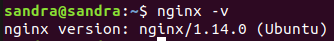

<h1 style="text-align:center"> PRÁCTICA NGINX</h1>


**Nginx** es un servidor web de código abierto, creado en 2004 y actualmente uno de los más utilizados a nivel mundial. También es utilizado como proxy inverso, balanceador de carga HTTP y proxy de correo electrónico para IMAP, POP3 y SMTP. Fue concebido como un intento de hacer frente al problema C10K (reto de gestionar 10000 conexiones al mismo tiempo).

**Características:**

- Es asíncrono, los subprocesos se ejecutan simultáneamente sin bloquearse entre sí.
- Controlado por eventos que marcan el inicio o finalización de un proceso.
- Su arquitectura optimiza la memoria y la CPU, haciéndolo más rápido.
- Puede procesar miles de solicitudes sin dificultad.
- No crea un nuevo proceso para cada nueva solicitud, el proceso acepta las solicitudes y las procesa a través de bucles.
- El rendimiento y la escalabilidad no dependen completamente de los recursos del hardware.

***

## OBJETIVOS DE LA PRÁCTICA

En esta práctica aprenderemos a utilizar y configurar el servidor Nginx y a crear Hosts Virtuales para alojar nuestros proyectos. Los **hosts virtuales** son alojamientos virtuales de nuestros sitios webs que sirven para poder ejecutar más de un sitio web en un mismo servidor, permitiéndonos así, compartir recursos.


**Instalación de Nginx**

```
sudo apt-get install nginx
```

Verificamos que esté instalado

```
nginx -v
```




A continuación debemos configurar el firewall para que permita el acceso a Nginx:

Para ello, debemos elegir que perfil de Nginx queremos permitir. Para listar los perfiles 
de Nginx, utilizamos el siguiente comando:

  ```
  sudo ufw app list
  ```


Los perfiles que ofrece Nginx son:

- Nginx Full: Abre el puerto 80 (tráfico normal, no cifrado) y el 443 (tráfico TLS/SSL cifrado).
- Nginx HTTP: Solo abre el puerto 80.
- Nginx HTTPS: Solo abre el puerto 443.

Elegimos habilitar el perfil _Full_, para ello tecleamos el siguente comando:

  ```
  sudo ufw allow 'Nginx Full'
  ```

**Comandos del servidor**

- Iniciar, parar, ver estado, reiniciar o recargar el servidor:

  ```
  sudo service nginx start/stop/status/restart/reload
  ```

- Verificar sintaxis

  ```
  sudo nginx -t
  ```

***

# SITIO 1

Este primer sitio permitirá visualizar una página php.

**Requisitos:**

1. Estar publicada en el puerto 82.
2. El directorio donde se encuentra el contenido del sitio será /var/www/sitioPhp.
3. Los logs se situarán en el directorio /etc/logs/sitioPhp
4. Debe tener activada la compresión de ficheros que superen los 80kb.
5. Dispondrá de una página que se mostrará al acceder a una ruta que no exista (404.html), que estará situada en /var/www/errores.
6. Al acceder al path http://localhost:82/public_files, el sitio web mostrará el listado de ficheros en formato json.
7. No permitirá el acceso al contenido de nuestro servidor cuando en el path del contenido a obtener, se encuentre la palabra private.


## 1. ESTAR PUBLICADO EN EL PUERTO 82

- Iniciamos el servidor Nginx

  ```
  sudo service nginx start
  ```

- Verificamos que esté iniciado

  ```
  sudo service nginx status
  ```

  


- Creamos el host virtual en la carpeta _/var/www_.

  ```
  sudo mkdir -p /var/www/sitioPhp
  ```

  


  - Otorgamos permisos de acceso y modificación.

  ```
  sudo chmod -R 755 /var/www/sitioPhp
  ```

- En su interior, creamos la página php que queremos mostrar

  ```
  sudo touch index.php
  ```

   


- Insertamos contenido en el archivo

  ```
  vim index.php
  ```

  

- Creamos el fichero de configuración de nuestro host virtual dentro del directorio /etc/nginx/sites-availabe, copiando el que nos proporciona Nginx por defecto (default) y que está situado en esa misma carpeta. Lo renombramos a sitioPhp.

 

- Lo editamos:

  - Cambiamos el puerto por donde publicaremos la página:

     

  - Le damos un nombre a nuestro servidor:

   

  - Modificamos el directorio donde se encuentra nuestra página:

    

  - Añadimos index.php tal como nos indica en el archivo de configuración, para que se reconozca nuestra aplicación:

   

  - Habilitamos el sitio, creando un enlace simbólico dentro de la carpeta _sites-enabled_ que hará referencia al fichero de configuración de nuestro host, creado en el directorio _sites-available_:

    ```
    sudo ln -s /etc/nginx/sites-available/sitioPhp /etc/nginx/sites-enabled
    ```

    

    - Verificamos sintaxis.
 
    ```
    sudo nginx -t
    ```

    

  - Recargamos la configuración de Nginx:

    ```
    sudo service nginx reload
    ```

  - Instalar php
  sudo apt install php-7.2
  php -v
  - Donar permisos a totes les carpetes
  - descomentar la part de php canviant la versio


# SITIO 2

Este segundo sitio permitirá acceder a una aplicación NodeJs que debe estar
ejecutándose en el puerto 3000 de nuestra máquina. Además, como requisitos, debe
cumplir:

- Estar publicado en el puerto 81
- El directorio donde se encuentra el contenido del sitio será /var/www/sitioNode
- Los logs se sitúan en el directorio /etc/logs/sitioNode
- Dispone de una página que se mostrará al acceder a una ruta que no exista.
    - Esta página (404.html) estará situada en /var/www/errores
- Al acceder a http://localhost:81/documentación se producirá una redirección a la página oficial de nodejs (https://nodejs.org/en/)


